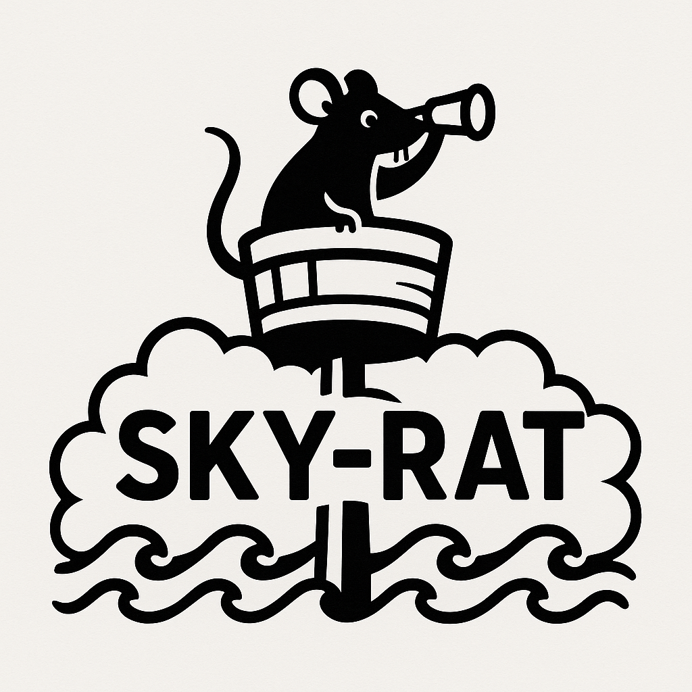

# SKY-RAT Boshrelease

<table>
  <tr>
    <td style="width: 300px"></td>
    <td style="width: 400px">
        <b>Sky-rat</b> (noun, slang): A humorous or mildly teasing nickname used by sailors to refer to the lookout stationed in
        the crow's nest of a ship. The term plays on the idea of someone being high up in the sky (on the mast) and constantly
        watching, like a rat scurrying about up high. It’s not offensive, but rather a playful jab among crewmates, often used
        when someone spends a lot of time in the lookout post or complains about the duty.
    </td>
  </tr>
</table>

